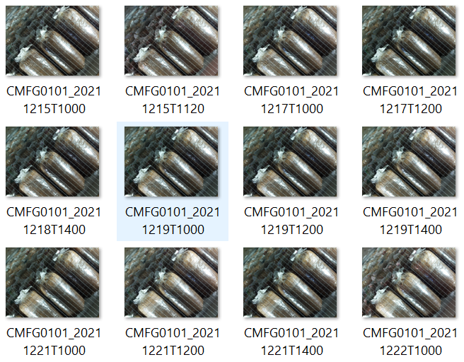
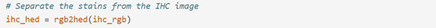
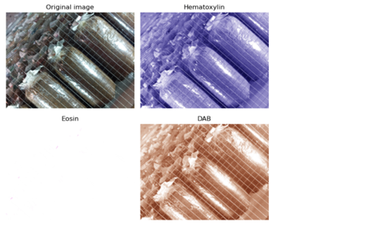
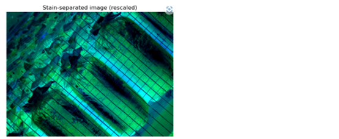
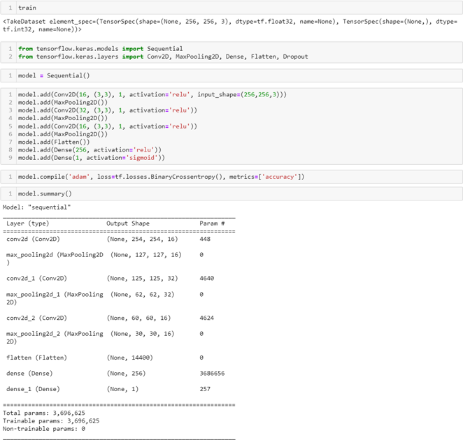
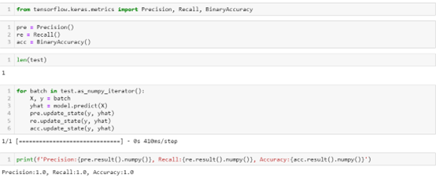
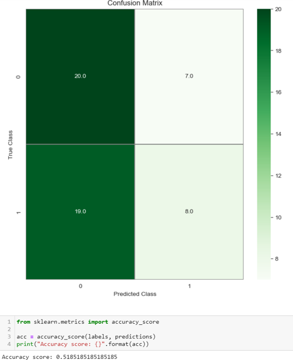
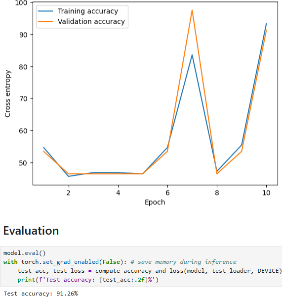

# 🍄 Development of Growth Measurement Methodology for Lingzhi Mushroom from Image Data

📌 Overview

This project focuses on designing and developing an image-based methodology to measure the growth stages of Lingzhi mushrooms cultivated in plastic bags under real-world industrial conditions.

Due to challenges such as low image clarity, reflections from plastic packaging, and lighting noise, this work emphasizes image enhancement techniques and deep learning models to improve detection and classification performance.

The system aims to analyze mushroom growth progression by extracting visual features from enhanced images and applying convolutional neural networks (CNNs) such as ResNet and VGGNet.

This work was conducted as part of a research and development task in collaboration with an industrial dataset provider.

---

## 🎯 Objectives

Develop a method to measure mushroom growth from image data
Improve image quality under challenging conditions (low light, reflection, noise)
Apply image enhancement techniques for better feature extraction
Build deep learning models for growth stage classification
Compare model performance (ResNet vs VGGNet)

---

## ✨ Core Features
- 📷 Image Enhancement under Real-world Conditions
- 🎨 Color Decomposition using IHC Staining (HED space)
- 🔍 Noise Reduction and Contrast Adjustment
- 🧠 Deep Learning Classification (CNN, ResNet, VGG16)
- 📊 Growth Stage Labeling (Percentage-based)
- ⚙️ Image Segmentation and Localization
---

## 🧠 Methodology

### 1️⃣ Data Preparation
Collect mushroom images from industrial environment
Handle reflection and low-quality images
Organize dataset into structured folders

### 2️⃣ Image Enhancement
Contrast adjustment
Noise reduction techniques
Image segmentation (if necessary)
Localization of mushroom region

### 3️⃣ Color Decomposition (IHC Staining)
Convert RGB → HED color space
Separate channels:
Hematoxylin (H)
Eosin (E)
DAB (D)
Analyze specific color features for better detection

### 4️⃣ Model Development
Train CNN-based models
Architectures used:
ResNet50
VGG16
Preprocessing: scaling, splitting datasets
Training and validation

### 5️⃣ Evaluation
Accuracy comparison
Model performance analysis
Visualization of results

---

## 🏗️ Tech Stack

Programming Language

Python

Libraries & Tools

OpenCV
Scikit-image
TensorFlow / Keras
PyTorch
NumPy
Matplotlib

Environment

Jupyter Notebook / Python Script

---

## 📸 Screenshots

### 🔐 Raw Dataset Example


### 🎨 IHC Staining - Color Decomposition


### 🧪 H, E, D Channel Separation


### 🔄 Image Enhancement Result


### 🧠 CNN Training Pipeline


### 📊 Model Evaluation


### 🧠 ResNet50 Results


### 🏠 🧠 VGG16 Results


---

## 📂 Project Structure

```plaintext
lingzhi-growth-detection/
│
├── data/                    # Raw and processed image datasets
├── enhanced/               # Enhanced images
├── models/                 # Trained CNN models
├── notebooks/              # Jupyter notebooks
├── utils/                  # Image processing & helper functions
│
├── train.py                # Model training script
├── evaluate.py             # Evaluation script
├── requirements.txt        # Dependencies
│
└── README.md
```

---

## 📊 Results

Image enhancement significantly improved feature visibility
IHC-based color decomposition helped isolate important features
ResNet achieved low accuracy (~0.52)
VGG16 achieved the best performance (~91.26% accuracy)
The proposed approach is effective for real-world mushroom growth monitoring

---

## 🚀 Future Improvements

- 📷 Real-time monitoring system using camera input
- 🌐 Web dashboard for visualization (Streamlit / Flask)
- 🤖 Apply advanced models (EfficientNet, Vision Transformer)
- 📊 Improve dataset size and labeling quality
- ⚡ Optimize for deployment in industrial environments

---

## 👨‍🎓 Author

Tanatorn Pethmunee
Prince of Songkla University

---

## 📄 License

This project is for educational and research purposes
